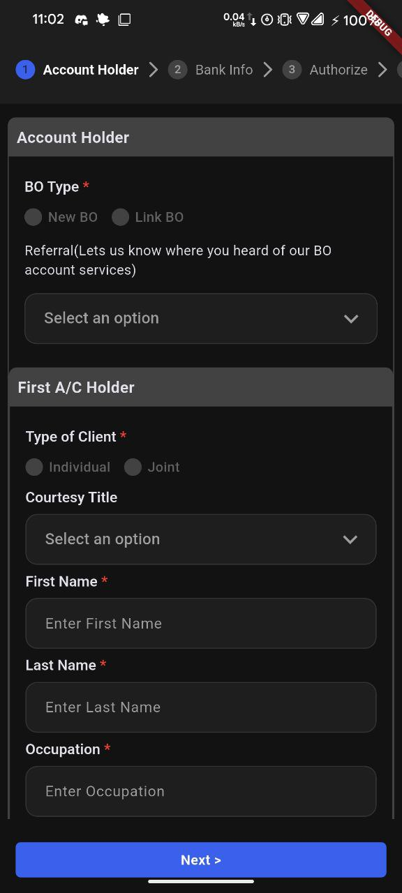
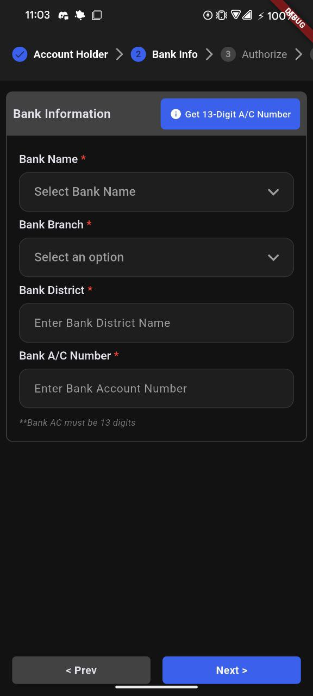
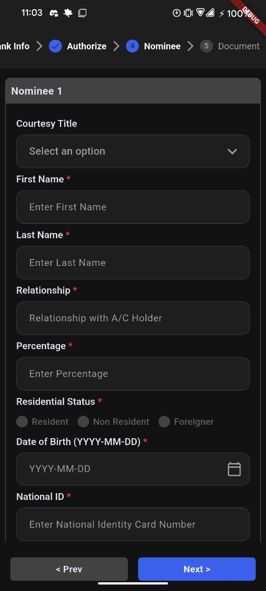
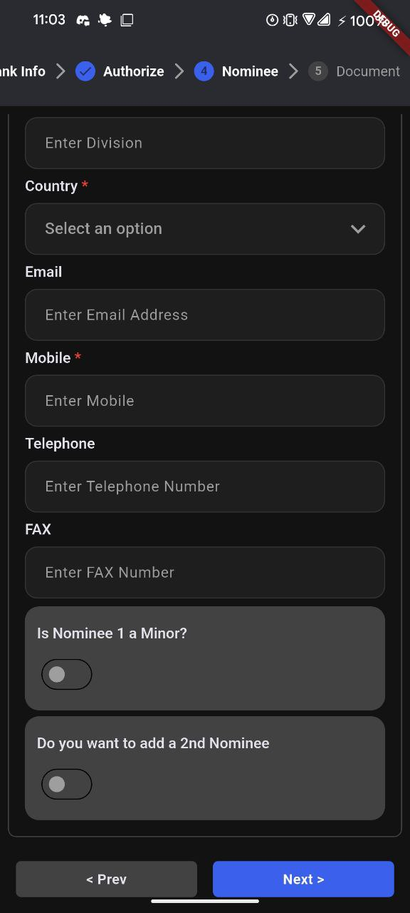
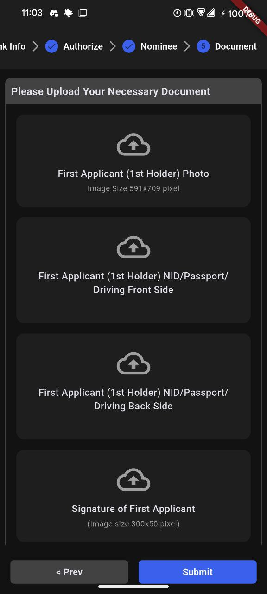
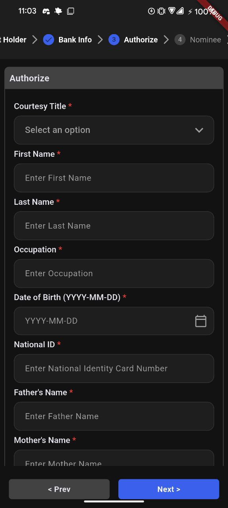
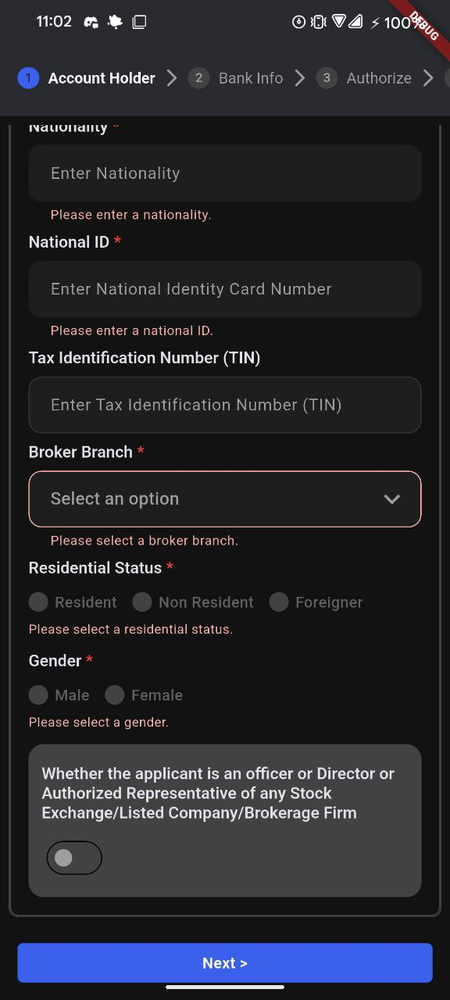

# BO Account Form

A Flutter application for managing BO (Beneficiary Owner) account forms. This project demonstrates a multi-step form implementation using `flutter_bloc` for state management, featuring a clean UI with light and dark mode support.

## Features

- **Multi-step Form Wizard**: Guided form submission using a stepper.
- **State Management**: Robust state handling with `flutter_bloc` (Cubit).
- **Theme Support**: Fully supported Light and Dark modes.
- **Form Validation**: Real-time validation for account holder details.
- **Dynamic Nominees**: Functionality to add extra nominees.

## Screenshots

### Light & Dark Mode
| Light Mode | Dark Mode |
|:---:|:---:|
|  |  |

### Form Steps

| Account Holder | Bank Info |
|:---:|:---:|
|  |  |

| Nominee | Extra Nominee |
|:---:|:---:|
|  |  |

| Documents | Authorization |
|:---:|:---:|
|  |  |

### Validation


## Getting Started

To run this project locally, you will need Flutter installed.

1.  **Clone the repository**
2.  **Install dependencies**:
    ```bash
    flutter pub get
    ```
3.  **Run the app**:
    ```bash
    flutter run
    ```

## Dependencies

- [flutter_bloc](https://pub.dev/packages/flutter_bloc)
- [image_picker](https://pub.dev/packages/image_picker)
- [path_provider](https://pub.dev/packages/path_provider)
- [intl](https://pub.dev/packages/intl)
